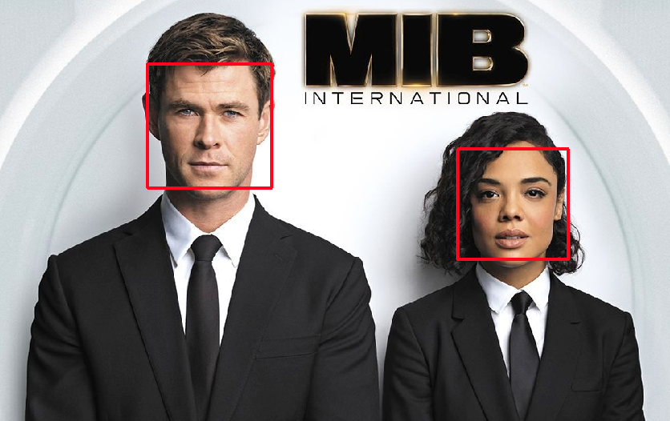
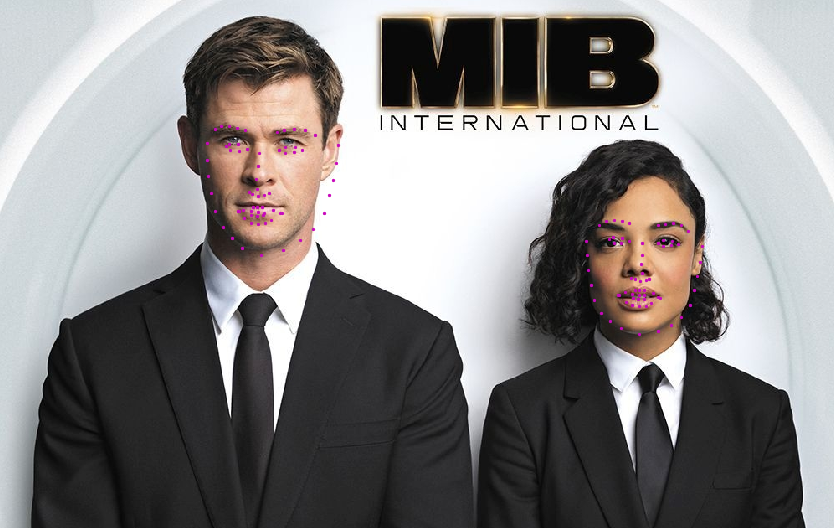
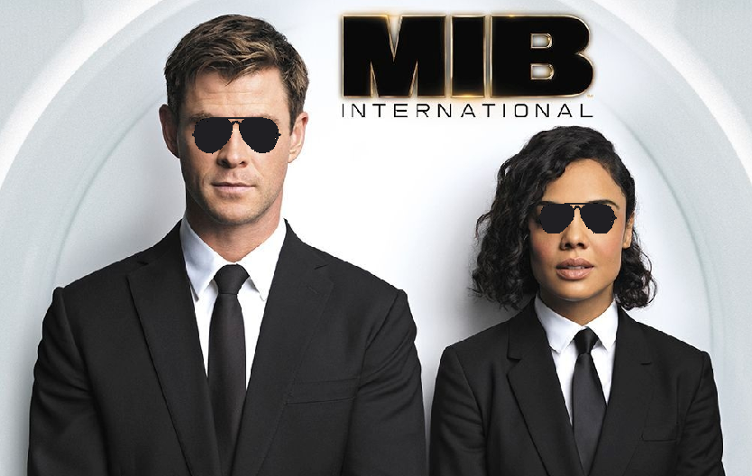

## Facial Keypoint Detection

The objective of this project is to detect faces present in an image, predict 68 keypoints (eyes, cheek, nose etc) of each face on the image, and add accessories such as sunglasses or a moustache to the correct position in each face.

First, the image is loaded. Here, we have Chris Hemsworth and Tessa Thompson as Men in Black agents.


Next, a pre-trained Haar Cascades model is used to detect both of their faces. The vertices of each red bounding box are provided to the rest of this machine learning pipeline.



Subsequently, a Convolutional Neural Network (CNN) detects 68 facial keypoints from each face. A <a href="https://arxiv.org/pdf/1710.00977.pdf">NaimishNet</a> model was trained for over 100 epochs on the YouTube Faces Dataset to achieve this. The predicted facial keypoints are the magenta dots superimposed on the image below.



Lastly, shades are added to each face on the image based on the coordinates of the facial keypoints near the eyes. The MIB agents are now ready for action!




### Running the Pipeline
1. Clone this repository:

```
git clone https://github.com/leeping-ng/ML-CV-Facial-Keypoint-Detection.git
cd ML-CV-Facial-Keypoint-Detection
```

2. Download the training and testing dataset and unzip it in the `PATH/data`:

```
wget -P data/ https://s3.amazonaws.com/video.udacity-data.com/topher/2018/May/5aea1b91_train-test-data/train-test-data.zip
unzip -n data/train-test-data.zip -d data
```

3. Go to section 2 (*Train CNN to Recognize Facial Keypoints*) in the Jupyter Notebook and run the cells to train the CNN. You may adjust the number of epochs and whether to use GPU (I highly recommend using GPU if possible) accordingly.

4. Save your favourite image in `PATH/images`, load it in section 1, and have fun!


